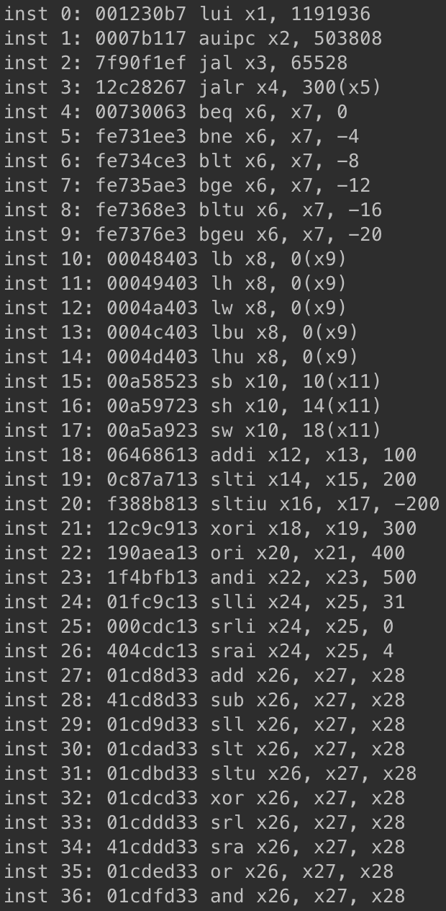
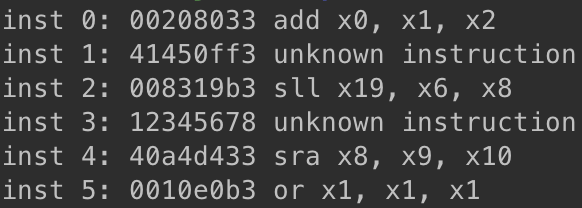

# Simplified-RISC-V-Decoder
A simplified version of RISC-V decoder that interprets instructions of RISC-V system and prints the instructions in Assembly language.
<!-- opcode 등으로 instructios를 구분하여 ~ 설명 추가 --> 

## ✍🏼 Usage
<code>python ./riscv-sim.py binary_source.bin</code>

## 🌱 Result
When the program is executed, the user can know what assembly code was included in the input file.  
    
If the given binary data is uninterpretable, the program prints 'unknown instruction'.  

